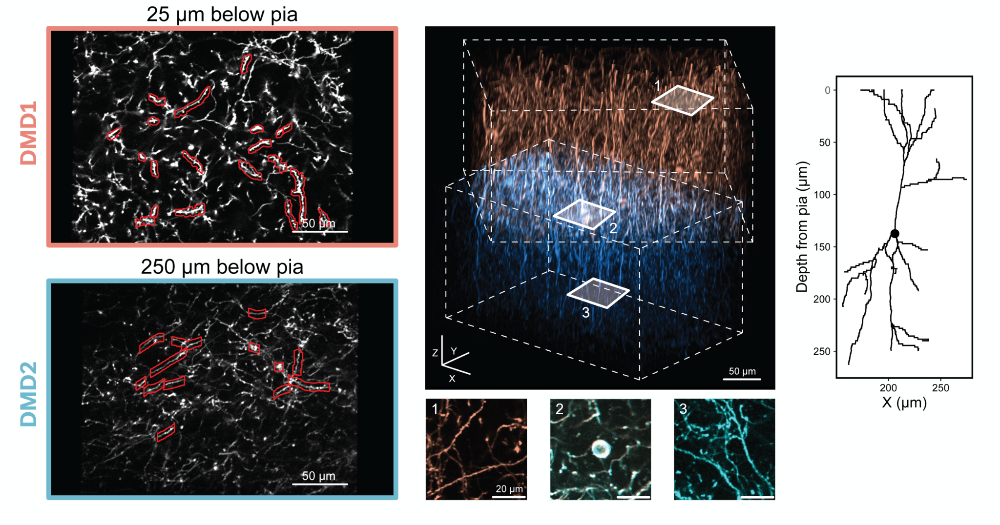

# SLAP2 volume alignment

`slap2-volume-align` is a small Python package for aligning, warping, merging, and visualizing structural imaging volumes from SLAP2 and ScanImage/Bruker acquisitions. The current most mature workflow is the **SLAP2 DMD reference-stack merge**: it takes two SLAP2 GUI-generated `*-REFERENCE.tif` stacks, one from each DMD, places them into a shared physical/sample coordinate system, optionally refines their overlap by correlation-based registration, and writes a Fiji/ImageJ-compatible merged super-stack plus QC outputs.

The repository also contains utilities for large ScanImage TIFF inspection, subsetting, averaging, bidirectional correction, and conservative z-plane registration, but the main workflow described below is for SLAP2 superstacks.

## Example output

The figure below shows the intended use case: two SLAP2 reference volumes acquired at different depths are transformed into a shared coordinate system and merged into a single super-stack. The left panels show example DMD reference images/ROIs, the center panel shows the colored super-stack alignment, and the right panel shows a morphology/depth schematic.



## What kind of alignment is performed?

The SLAP2 merge is **not landmark-based** and **not non-rigid**. It uses a staged alignment strategy:

1. **Metadata-based affine placement**
   - Each SLAP2 `*-REFERENCE.tif` contains per-plane JSON metadata.
   - The key field is `dmdPixel2SampleTransform`, which maps DMD image pixels into a common SLAP2/sample coordinate system.
   - This affine transform accounts for global rotation, translation, scale, and shear between DMDs.

2. **Z interpolation into a common output grid**
   - The pipeline reads the physical z position of each plane from the TIFF metadata.
   - DMD1 and DMD2 are sampled into a shared `z, y, x` grid at the requested XY and Z spacing.

3. **Optional residual correlation-based XY refinement**
   - With `--fine-register-overlap`, the pipeline uses intensity/phase-correlation registration in the overlapping anatomy to estimate a residual rigid XY shift for DMD2 relative to DMD1.
   - This is a small correction after the metadata transform, not a full re-registration or non-rigid warp.

4. **Optional axial offset correction**
   - If overlap diagnostics show that the two DMD volumes are shifted in z, apply a manual DMD2 z offset with `--dmd2-z-offset-um`.
   - For example, a five-plane offset at 1.5 µm/plane corresponds to `7.5 µm`. In one example dataset, DMD2 was shifted 5 planes more superficial using `--dmd2-z-offset-um -7.5`.

5. **Feathered blending**
   - DMD1 and DMD2 are written separately as warped intermediate TIFFs.
   - The final super-stack is produced by weighted/feathered blending across the spatial and axial overlap.

In short: **metadata-affine alignment + optional correlation-based residual rigid XY correction + optional manual/diagnostic Z correction + feathered blending**.

## Repository layout

```text
slap2-volume-alignment/
├── src/slap2_volume_align/
│   ├── cli.py                         # command-line interface: slap2-align
│   ├── core/                          # reusable registration, transforms, preprocessing
│   ├── readers/                       # TIFF readers/helpers
│   ├── qc/                            # QC plotting helpers
│   ├── sources/
│   │   ├── scanimage/                 # ScanImage/Bruker-specific workflows
│   │   └── slap2/                     # SLAP2 reference-stack parsing and merging
│   └── visualization/                 # optional viewer utilities
├── notebooks/
│   ├── image_alignment/SLAP2/         # SLAP2 merge/QC notebook
│   ├── image_alignment/ScanImage/     # ScanImage averaging/QC notebook
│   └── visualization/                 # presentation and napari visualization notebooks
├── docs/
│   └── assets/                        # README figures
├── tests/                             # lightweight unit tests
├── pyproject.toml
└── README.md
```

## Installation

From a terminal or Anaconda prompt, clone the repo and install it in editable mode.

```bash
git clone <repo-url>
cd slap2-volume-alignment

# Recommended: create a clean environment
conda create -n slap2-align python=3.9 -y
conda activate slap2-align

# Core package
pip install -e .

# Optional notebook dependencies
pip install -e ".[notebooks]"

# Optional napari/viewer dependencies
pip install -e ".[viewer]"
```

On Windows, run commands from the repository root. If using network paths such as `\\allen\aind\scratch\...`, quote the paths. For large files, it is usually more stable to read from the network but save intermediate figures locally and copy them back after export.

Check that the command-line entry point is available:

```bash
slap2-align version
slap2-align --help
```

## Inputs expected for SLAP2 super-stack merging

The basic SLAP2 merge workflow expects two GUI-generated reference stacks:

```text
structure_volume_YYYYMMDD_HHMMSS_DMD1-REFERENCE.tif
structure_volume_YYYYMMDD_HHMMSS_DMD2-REFERENCE.tif
```

The TIFF page metadata should contain:

- `z`: physical z position of the plane,
- `channel`: channel index,
- `acquisitionPathIdx`: DMD/path identity,
- `dmdPixel2SampleTransform`: 4 x 4 affine transform from DMD pixels to sample coordinates.

The neighboring `.meta` files are useful for provenance, but the merge workflow primarily uses the metadata embedded in the `*-REFERENCE.tif` files.

## Quick start: align and merge two DMD reference stacks

### 1. Define paths

Example Windows paths:

```text
DMD1 = \\allen\aind\scratch\...\structure_volume_20260617_132712_DMD1-REFERENCE.tif
DMD2 = \\allen\aind\scratch\...\structure_volume_20260617_132712_DMD2-REFERENCE.tif
OUT  = \\allen\aind\scratch\...\super_stack_qc\full_reference_merge
```

### 2. Generate footprint QC

This plots the DMD footprints in sample coordinates and previews the output grid.

```bash
slap2-align slap2-footprints \
  "path/to/structure_volume_DMD1-REFERENCE.tif" \
  "path/to/structure_volume_DMD2-REFERENCE.tif" \
  "path/to/output_dir" \
  --xy-resolution-um 0.25 \
  --z-resolution-um 1.5
```

On Windows `cmd.exe`, use caret line continuations:

```cmd
slap2-align slap2-footprints ^
  "path\to\structure_volume_DMD1-REFERENCE.tif" ^
  "path\to\structure_volume_DMD2-REFERENCE.tif" ^
  "path\to\output_dir" ^
  --xy-resolution-um 0.25 ^
  --z-resolution-um 1.5
```

### 3. Run an initial metadata-based merge

Start with no axial offset. Keep `--fine-register-overlap` enabled unless you specifically want a metadata-only baseline.

```bash
slap2-align slap2-merge-dmds \
  "path/to/structure_volume_DMD1-REFERENCE.tif" \
  "path/to/structure_volume_DMD2-REFERENCE.tif" \
  "path/to/output_dir" \
  --xy-resolution-um 0.25 \
  --z-resolution-um 1.5 \
  --dmd2-z-offset-um 0 \
  --fine-register-overlap
```

### 4. Inspect the outputs

The merge writes these files:

```text
slap2_super_stack_ch1.tif                 # final blended super-stack
dmd1_warped_ch1.tif                       # DMD1 after warping into output grid
dmd2_warped_ch1.tif                       # DMD2 after warping into output grid
dmd1_weights_ch1.tif                      # DMD1 blend weights
dmd2_weights_ch1.tif                      # DMD2 blend weights
merge_weights.tif                         # total/summary weights
slap2_dmd_footprints_qc.png               # DMD footprints and output grid
slap2_super_stack_merge_qc.png            # merge QC summary
slap2_super_stack_merge_summary.json      # parameters, transforms, shifts, outputs
```

Open these in Fiji/ImageJ or napari:

- `slap2_super_stack_ch1.tif` should look like one continuous volume.
- `dmd1_warped_ch1.tif` and `dmd2_warped_ch1.tif` should occupy the correct upper/lower portions of the same coordinate system.
- The overlap should not show obvious duplicate cells or repeated dendrites.

### 5. Estimate and apply a z offset if needed

If anatomy appears duplicated across the DMD overlap, the DMDs may need a small axial correction. The notebook:

```text
notebooks/image_alignment/SLAP2/SLAP2_SuperStack_Merge_QC.ipynb
```

contains cells for comparing the DMD1 and DMD2 overlap as a z-similarity matrix. If the best overlap is shifted by several planes, rerun the merge with a DMD2 z offset.

Example: if DMD2 appears 5 planes too deep at `1.5 µm/plane`, shift DMD2 7.5 µm superficial:

```bash
slap2-align slap2-merge-dmds \
  "path/to/structure_volume_DMD1-REFERENCE.tif" \
  "path/to/structure_volume_DMD2-REFERENCE.tif" \
  "path/to/output_dir" \
  --xy-resolution-um 0.25 \
  --z-resolution-um 1.5 \
  --dmd2-z-offset-um -7.5 \
  --fine-register-overlap
```

Then re-check `slap2_super_stack_ch1.tif`, `dmd1_warped_ch1.tif`, `dmd2_warped_ch1.tif`, and the QC PNGs.

## Recommended workflow for a new dataset

1. Generate DMD1 and DMD2 `*-REFERENCE.tif` files in the SLAP2 GUI.
2. Install this package with `pip install -e .`.
3. Run `slap2-footprints` to verify DMD footprints and z ranges.
4. Run `slap2-merge-dmds` with `--dmd2-z-offset-um 0 --fine-register-overlap`.
5. Inspect the warped DMD TIFFs and final super-stack in Fiji or napari.
6. Use the SLAP2 merge/QC notebook to estimate whether a DMD2 z offset is needed.
7. Rerun the merge with the corrected `--dmd2-z-offset-um`.
8. Use `dmd1_warped_ch1.tif` and `dmd2_warped_ch1.tif` as separate channels for presentation/QC figures.

## Python API example

The CLI is the easiest entry point, but the merge can also be run from Python:

```python
from pathlib import Path
from slap2_volume_align.sources.slap2.merge import Slap2MergeConfig, merge_dmd_reference_stacks

config = Slap2MergeConfig(
    dmd1_tif=Path("path/to/structure_volume_DMD1-REFERENCE.tif"),
    dmd2_tif=Path("path/to/structure_volume_DMD2-REFERENCE.tif"),
    out_dir=Path("path/to/output_dir"),
    channel=1,
    xy_resolution_um=0.25,
    z_resolution_um=1.5,
    dmd2_z_offset_um=-7.5,
    fine_register_overlap=True,
    xy_feather_px=32,
)

summary = merge_dmd_reference_stacks(config)
print(summary["outputs"])
```

## Presentation visualization

For a slide-friendly two-color visualization, use the warped DMD outputs rather than splitting the final blended stack:

```text
dmd1_warped_ch1.tif
dmd2_warped_ch1.tif
```

These files preserve source identity after both DMDs have been placed into the shared coordinate system. In Fiji/ImageJ, open both, merge them as channels, assign DMD1 a warm red/orange LUT and DMD2 a blue/cyan LUT, then use the 3D Viewer, Volume Viewer, or napari for oblique screenshots.

Relevant notebooks:

```text
notebooks/visualization/TwoColor_Hyperstack_Presentation_Render.ipynb
notebooks/visualization/SLAP2_SuperStack_Presentation_Render.ipynb
notebooks/visualization/SLAP2_napari__visualization.ipynb
```

## ScanImage/Bruker utilities

The package also includes a ScanImage averaging workflow for large TIFFs:

```bash
slap2-align scanimage-average \
  "path/to/large_scanimage_stack.tif" \
  "path/to/output_dir" \
  --n-planes 177 \
  --repeats-per-plane 20 \
  --n-channels 1 \
  --order slice_blocks \
  --registration-binning 2 \
  --upsample-factor 10
```

Optional flags support bidirectional correction and conservative crop-based z-plane registration. See:

```text
notebooks/image_alignment/ScanImage/ScanImage_Alignment_QC.ipynb
```

## Troubleshooting

### `ModuleNotFoundError: No module named 'slap2_volume_align'`

Run from the repository root:

```bash
pip install -e .
```

Then restart the Jupyter kernel.

### Windows network error while writing PNG/PDF outputs

If you see a network error such as `WinError 64`, save figures to a local folder first, then copy them back to the network share. Large files and long UNC paths are more fragile for writes than reads.

### The merged stack shows duplicated cells in the overlap

This usually means either:

- residual XY correction was not enabled, or
- the DMD2 z offset is wrong.

Rerun with `--fine-register-overlap`, inspect the z-similarity diagnostic in the SLAP2 notebook, then rerun with an updated `--dmd2-z-offset-um`.

### The overlap is too abrupt or has a visible seam

Try increasing the feather width:

```bash
--xy-feather-px 64
```

Also check the DMD-specific warped TIFFs and weight TIFFs to determine whether the seam is caused by intensity differences, missing data, or geometric misalignment.

## Development notes

Run tests from the repository root:

```bash
pip install -e ".[notebooks]"
pytest -q
```

If running tests without installing the package, set `PYTHONPATH=src` first.

## License

See `LICENSE`.
